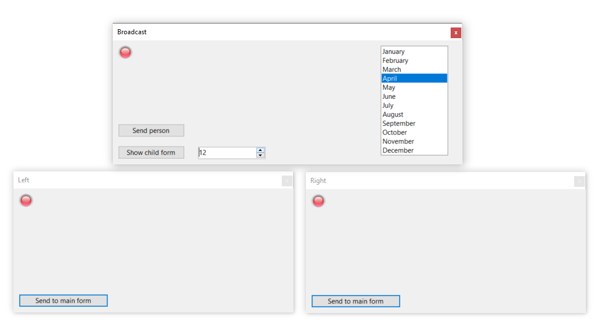

# About

An example for broadcasting information between open forms.

## Examples

- Change an int value in main form, go over a value and the picturebox image changes in all forms.
- Pass strings to main form from child form