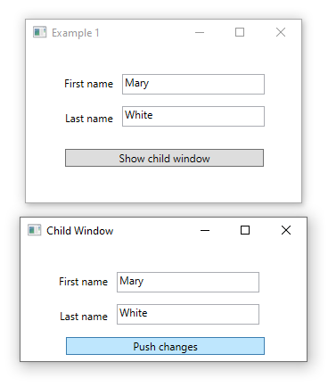

# Broadcast/Listen

This project shows how to use Broadcast and listen although this would be th wrong path to go, instead using DependencyProperty in code behind and Binding in XAML Binding using RelativeSource={RelativeSource FindAncestor. . .

